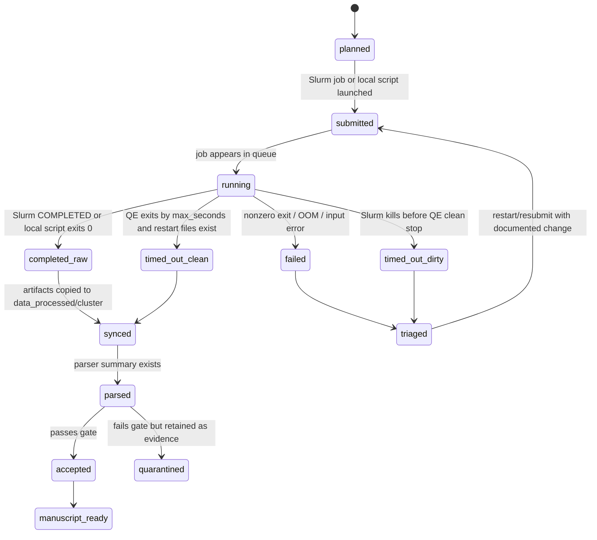

# Experiment State Machine

## Node Status Lifecycle

## QE NEB Restart Loop

1. Generate explicit-image `neb.in` from MACE images.
2. Patch `max_seconds = walltime_seconds - safety_margin`.
3. Submit Slurm job under `/scratch16/pclancy3/yi/revision1_migrationbench_runs`.
4. If QE stops cleanly but not converged, copy previous run directory to next run and set `restart_mode='restart'`.
5. Continue until the parser gate passes or the path is quarantined with a documented reason.

## Status Update Checklist

When a job finishes:

- Record job id, job name, state, exit code, elapsed time, node.
- Sync compact outputs back to `Revision1/data_processed/cluster/<job>/`.
- Parse `neb.out` or read `mlff_neb_manifest.json`.
- Write or update the branch manifest beside the job artifacts.
- Append one event to `state/workflow_events.jsonl` with lineage, config, metrics, and decision.
- Update `workflow_nodes.md`.
- Update `reviewer_response_matrix.md` only if the result changes a reviewer answer.
- Update `manuscript_edit_plan.md` only if the result changes a figure/table/text dependency.
- Keep failed and quarantined records; do not delete them from the provenance chain.

## Branch Decision Checklist

Before a branch is allowed to feed the next branch, check:

- source images and parent branch are identified
- every generated QE input has a companion manifest
- every repair records before/after geometry metrics
- every MACE branch records per-image relaxation energy delta
- every QE branch records walltime, `max_seconds`, restart mode, and parsed sanity metrics
- failures are kept as quarantined evidence rather than overwritten

## State Colors For The HTML DAG

- `done`: green
- `partial`: yellow
- `pending`: blue
- `blocked`: red
- `quarantined`: gray

The colors are only cues. The authoritative state is the Markdown node table and the evidence path.
