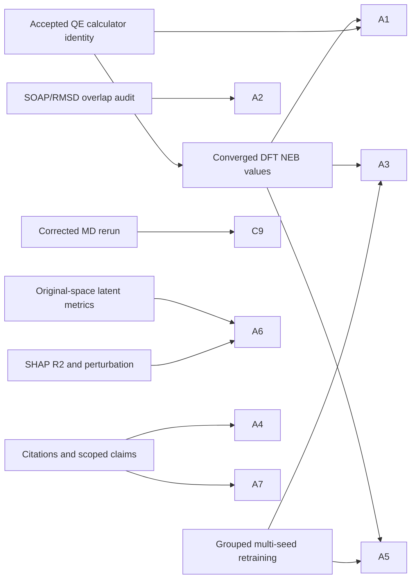

# Reviewer Response Matrix

## Main Reviewer Items

| Item | Reviewer concern | Status | Upstream nodes | Response action | Manuscript action | Placeholder |
|---|---|---|---|---|---|---|
| A1 | Fig. 3d fixed-path +0.7 eV vs Fig. S3 self-NEB 0.41 eV; 0.34 vs ~0.3 eV; historical QE settings also conflict with the SI Methods | path/0.41 defect resolved; replacement data pending | N2, N3, N4, N5, N6, N8, N24 | State that Fig. 3d is a 61-atom Cr1 fixed path while Fig. S3 is an invalid mixed-calculator 82-atom Cr2 run; remove 0.41 eV and qualitative overclaim; report only accepted same-system values | Revise §3.2, SI Methods, and replace Fig. S3/NEB table | `[NUMBER-PENDING: accepted DFT barrier / k-point-spin-SOC gates / corrected same-system self-NEB]` |
| A2 | Rule out train/test overlap for FT-600K | evidence-complete-scoped | N7 | Report the zero-match SOAP/RMSD audit for the declared checkpoint files and state that unknown foundation pretraining data are outside the auditable scope | Methods data split; SI overlap figure | none for the declared checkpoint; rerun gate applies if data change |
| A3 | Need seed uncertainty for Scratch and FT-600K | pending | N9, N6 | Report mean +/- std over seeds; decide "chance" claim by pre-registered rule | Replace deep-penetration discussion and Table S1 | `[NUMBER-PENDING: multi-seed]` |
| A4 | Overbroad generalizability claims | done-local | N8, N14 | State candidate framework demonstrated on one system | Abstract, Introduction, Conclusion hedged | none |
| A5 | Scratch-5% control | pending | N9 | Add random-init same-data-volume control | New paragraph and Table S1 extension | `[NUMBER-PENDING: Scratch-5%]` |
| A6 | t-SNE/PHATE and SHAP claims too strong | partial | N12, N13 | Report original-space metrics, sensitivity, surrogate R2, perturbation status | Fig. 5/6 captions and §3.4-3.5 wording | `[NUMBER-PENDING: perturbation if retained]` |
| A7 | Need nearest-neighbor citations and delta from prior arXiv | done-local | N14 | Add citations and delta paragraph | Intro, related discussion, bibliography | none |

## Repository/Code Items

| Item | Reviewer concern | Status | Upstream nodes | Response action | Manuscript/code action | Placeholder |
|---|---|---|---|---|---|---|
| C8 | Fabricated all-zero forces in NEB exporters | done-local evidence; release fix tracked | N7 | Confirm not used in reported training; hard-disable fake-force export | Methods provenance sentence; code release notes | none unless code repo final diff not merged |
| C9 | Asymmetric MD protocol for naive FT | partial | N11 | Admit and rerun/recompute with correct protocol | Fig. 2/table update; FT-600K old value quarantined | `[NUMBER-PENDING: corrected FT-600K MD]` |
| C10 | Ungrouped random train/test split | partial | N7, N9 | Explain grouped split and zero group overlap | Methods split description; retrained Table S1 | `[NUMBER-PENDING: grouped-split retrain]` |
| C11 | Silhouette computed on t-SNE/PHATE embedding | done-local | N12 | Replace with original-space/PCA metrics; label embedding metric invalid baseline | Fig. 5 caption and SI robustness | none for local result; text still needs final integration |
| C12 | Always-zero force-sensitivity stub | done-local | N12 | Remove/drop dead feature; note finite-difference feature as future work | Methods/SI latent feature description | none |
| C13 | SHAP code absent and stubs | partial | N13 | Port real SHAP pipeline; remove/implement stubs; report R2 | Code availability and §3.5 | `[NUMBER-PENDING: final code release / perturbation]` |

## Reviewer Reply Dependency Logic

