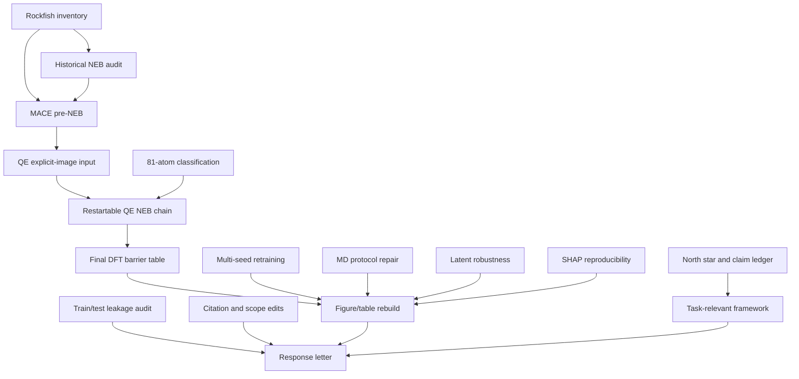

# Workflow Nodes

Use this as the Obsidian node table. Each node has a status, upstream dependencies, downstream consumers, method, and acceptance gate.

## Node Table

| Node | Status | Upstream | Downstream | Method | Acceptance |
|---|---|---|---|---|---|
| N0 North star and claim ledger | done | reviewer.md, manuscript tex | all nodes | Convert claims into auditable data dependencies | Every risky claim maps to reviewer item and edit ref |
| N1 Rockfish inventory | done | SSH/Rockfish paths | N2, N3, N4, N10 | Locate `/data/pclancy3/yi/...` and `/scratch16/...` roots | Paths documented; `/data` read-only; scratch target set |
| N2 Historical NEB audit | partial | N1, historical `neb.out` | N3, N8, R-A1 | Parse barriers/convergence from raw QE logs | Candidate values separated from manuscript-grade references |
| N3 MACE pre-NEB pipeline | partial | N1, historical images, MACE model | N4, N5, N8 | ASE NEB with MACE; write manifest and images | Manifest has seed, SHA, energy profile, relaxation delta |
| N4 QE explicit-image input generation | partial | N3, QE template | N5 | Generate `neb.in` with `BEGIN_POSITIONS` and config manifest | `neb.in` parses; manifest records source MLFF and source QE |
| N5 Restartable QE NEB chain | pending | N4 | N6, N8, R-A1 | Slurm walltime + QE `max_seconds`; restart from previous run dir | Runs to convergence or clean restart-compatible stop |
| N6 Final DFT barrier table | pending | N5 | Fig 3, SI NEB table, R-A1/A3/A5 | Parse final `neb.out` and regenerate tables | Barrier passes gate or is explicitly quarantined |
| N7 Train/test leakage audit | partial | fine-tuning data, NEB images | R-A2, Methods | Force-column audit done; SOAP/RMSD nearest-neighbor pending | No near duplicate below threshold or exclusion-retrain done |
| N8 Task-relevant benchmark framework | partial | N2, N3, N5, N6 | Introduction, Methods, Discussion, R-A4/A7 | Define fixed-path, self-relaxed, reporting, and geometry errors | Metrics and dataset fields are implementable and cited consistently |
| N9 Multi-seed retraining | pending | grouped split fix, cluster training | R-A3, R-A5, Table S1 | Scratch/FT-600K/Scratch-5% seeds {123,234,345} | Mean +/- std with grouped split and zero group overlap |
| N10 81-atom path classification | partial | N1, 81-atom trajectories | deep-penetration evidence, N5/N6 | Continuous geometry descriptors | `neb_1`-`neb_5` classified; DFT values remain quarantined |
| N11 MD protocol repair | partial | old MD scripts/logs | Fig 2, R-C9 | Patch protocol, block-average valid runs, rerun FT-600K | Corrected trajectory length; uncertainty reported |
| N12 Latent robustness | done-local | feature matrices | Fig 5, R-A6/C11/C12 | Original-space/PCA/t-SNE sensitivity checks | Projection-only claims removed or labelled invalid |
| N13 SHAP reproducibility | partial | archived SHAP pipeline | Fig 6, R-A6/C13 | Port pipeline, report CV R2, run perturbation if possible | Claims scoped to surrogate unless perturbation confirms MACE response |
| N14 Citation and scope edits | done-local | reviewer literature items | Intro, Conclusion, R-A4/A7 | Add nearest-neighbor citations and hedge generalization | No unsupported "generalizable standard" claim remains |
| N15 Figure/table rebuild | pending | N6, N9, N11, N12, N13 | manuscript PDF, response letter | Regenerate all changed visuals from scripts | No figure-caption mismatch; every number traceable |
| N16 Response letter finalization | pending | N6-N15 | submission package | Replace placeholders and align with manuscript | No `[NUMBER-PENDING]` remains unless explicitly excluded |

## Edges

## Current Risk Reading

The critical path is dominated by N5 and N6. Until restartable QE NEB reaches a defensible convergence state, reviewer A1 cannot be fully closed and Fig. 3/SI should keep placeholders.
